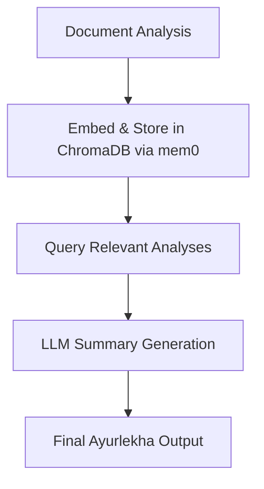

# Ayurlekha Processing Engine: Scalable Vector Memory Strategy

## Overview
This document outlines our strategy for scalable, efficient handling of medical document analyses using vector databases and LLMs. We will start with **ChromaDB** (local, fast, open-source) as our vector store via **mem0**, and later migrate to **Supabase** for cloud-based, production-ready storage.

---

## Why Vector DBs?
- **Semantic search**: Retrieve relevant analyses by meaning, not just keywords.
- **Scalability**: Efficiently handle thousands of documents per patient.
- **LLM integration**: Feed only the most relevant context to LLMs for summary generation.

---

## Phase 1: Local Development with ChromaDB + mem0

### How it Works
- Each `analysis.txt` (or its parsed/structured version) is embedded and stored in ChromaDB via mem0.
- When generating the final Ayurlekha, we query ChromaDB for relevant memories (by patient, type, recency, or semantic similarity).
- Only the most relevant analyses are fed to the LLM for summary generation.

### Required Changes
1. **Install ChromaDB and mem0**
   - Add to `requirements.txt`:
     ```
     chromadb
     mem0
     ```
2. **Configure mem0 to use ChromaDB**
   - Example config:
     ```python
     from mem0 import Memory
     config = {
         "vector_store": {
             "provider": "chromadb",
             "config": {
                 "persist_directory": "./chromadb_data",
                 "collection_name": "memories"
             }
         }
     }
     m = Memory.from_config(config)
     ```
3. **Store Each Analysis**
   - After generating each `analysis.txt`, embed and add it to mem0:
     ```python
     m.add({"role": "analysis", "content": analysis_text}, user_id=patient_id, metadata={...})
     ```
4. **Retrieve for Summary Generation**
   - When generating Ayurlekha, query mem0 for the most relevant analyses:
     ```python
     results = m.query("summarize patient X", user_id=patient_id, top_k=5)
     # Use results as context for LLM
     ```
5. **Update Pipeline**
   - Refactor pipeline to use mem0 for both storage and retrieval of analyses.

---

## Phase 2: Migration to Supabase + mem0

- When ready for production/cloud, switch mem0 config to use Supabase as the vector store (see [mem0 Supabase docs](https://docs.mem0.ai/components/vectordbs/dbs/supabase)).
- No major code changes needed—just update the config and connection string.

---

## Workflow Diagram


---

## References
- [mem0 Docs](https://docs.mem0.ai/components/vectordbs/dbs/chromadb)
- [ChromaDB](https://www.trychroma.com/)
- [Supabase Vector DB](https://docs.mem0.ai/components/vectordbs/dbs/supabase)
- [OpenAI Cookbook: Summarizing Long Texts](https://cookbook.openai.com/examples/summarize_long_texts)
- [RAG: Retrieval-Augmented Generation](https://arxiv.org/abs/2005.11401)

---

## Summary Table
| Phase   | Vector DB | Storage Location | Use Case         | Migration Effort |
|---------|-----------|------------------|------------------|------------------|
| Phase 1 | ChromaDB  | Local            | Dev, prototyping | None             |
| Phase 2 | Supabase  | Cloud            | Production       | Update config    |

---

## Next Steps
- [ ] Add ChromaDB and mem0 to requirements.
- [ ] Implement mem0-based storage and retrieval in the pipeline.
- [ ] Test local workflow end-to-end.
- [ ] Plan for Supabase migration when ready.

