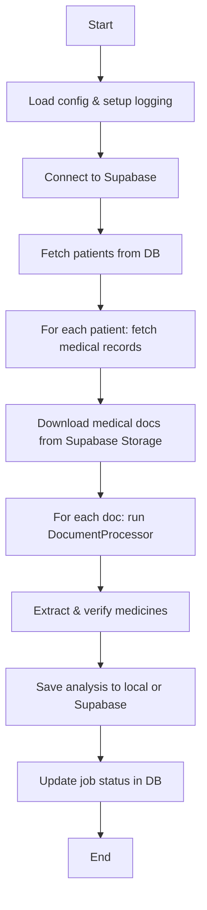

# Ayurlekha Processing Flow

```mermaid
flowchart TD
    A[Start] --> B[Load config & setup logging]
    B --> C[Connect to Supabase]
    C --> D[Fetch patients from DB]
    D --> E[For each patient: fetch medical records]
    E --> F[Download medical docs from Supabase Storage]
    F --> G[For each doc: run DocumentProcessor]
    G --> H[Extract & verify medicines]
    H --> I[Save analysis to local or Supabase]
    I --> J[Update job status in DB]
    J --> K[End]
``` 